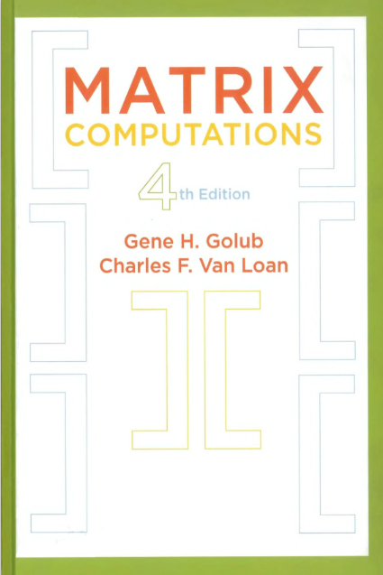

# Algorithms of Golub and Van Loan's Matrix Computations 4th edition

Python codes of all algorithms presented by Golub and Van Loan (2013)
at the 4th edition of their outstanding book [Matrix Computations](https://jhupbooks.press.jhu.edu/title/matrix-computations).

